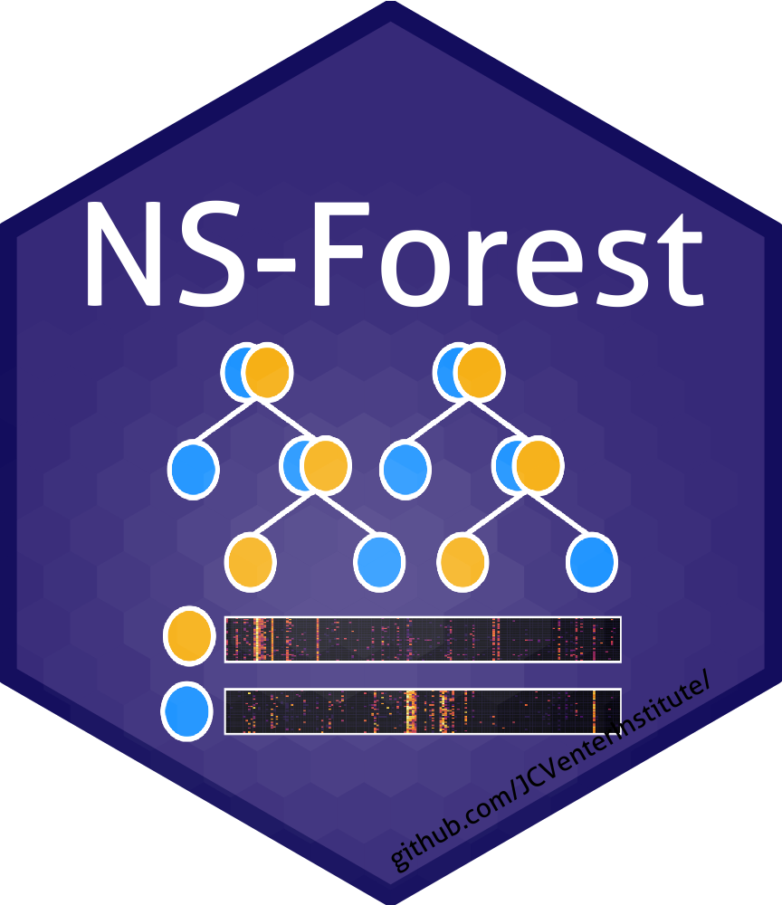

# NS-Forest

## Getting Started

Download NSForest_v3dot9_1.py.

### Prerequisites

* This is a python script written and tested in python 3.8, scanpy 1.8.2, anndata 0.8.0.
* Other required libraries: numpy, pandas, sklearn, itertools, time, tqdm.

### Tutorial

Follow the [tutorial](https://jcventerinstitute.github.io/celligrate/tutorials/NS-Forest_tutorial.html) to get started.

## Versioning and citations

This is version 3.9.1. Earlier releases are managed in [Releases](https://github.com/JCVenterInstitute/NSForest/releases).  

Version 2 and beyond:

Aevermann BD, Zhang Y, Novotny M, Keshk M, Bakken TE, Miller JA, Hodge RD, Lelieveldt B, Lein ES, Scheuermann RH. A machine learning method for the discovery of minimum marker gene combinations for cell-type identification from single-cell RNA sequencing. Genome Res. 2021 Jun 4:gr.275569.121. doi: 10.1101/gr.275569.121.

Version 1.3/1.0:

Aevermann BD, Novotny M, Bakken T, Miller JA, Diehl AD, Osumi-Sutherland D, Lasken RS, Lein ES, Scheuermann RH. Cell type discovery using single-cell transcriptomics: implications for ontological representation. Hum Mol Genet. 2018 May 1;27(R1):R40-R47. doi: 10.1093/hmg/ddy100.

## Authors

* Yun (Renee) Zhang zhangy@jcvi.org
* Richard Scheuermann RScheuermann@jcvi.org
* Brian Aevermann baevermann@chanzuckerberg.com

## License

This project is licensed under the [MIT License](https://github.com/JCVenterInstitute/NSForest/blob/master/LICENSE).

## Acknowledgments

* BICCN
* Allen Institute of Brain Science
* Chan Zuckerberg Initiative
* California Institute for Regenerative Medicine