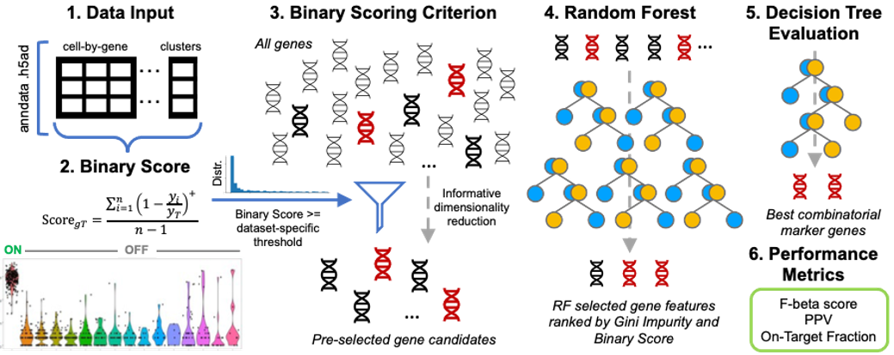

# NS-Forest v4.0

Documentation: https://nsforest.readthedocs.io/en/latest/

BioArchive Link: https://www.biorxiv.org/content/10.1101/2024.04.22.590194v1.full

## Download and installation

In terminal: 

git clone https://github.com/JCVenterInstitute/NSForest.git

cd NSForest

conda env create -f nsforest.yml

conda activate nsforest

## Tutorial

Follow the on readthedocs: https://nsforest.readthedocs.io/en/latest/tutorial.html

## Pipeline

Will be uploaded to official PyPI channel soon.

## Prerequisites
* This is a python script written and tested in python 3.11, scanpy 1.9.6.
* Other required libraries: numpy, pandas, sklearn, plotly, time, tqdm.

## Versions and citations

This is version 4.0.0. Earlier versions are managed in [Releases](https://github.com/JCVenterInstitute/NSForest/releases).  

Version 2:

Aevermann BD, Zhang Y, Novotny M, Keshk M, Bakken TE, Miller JA, Hodge RD, Lelieveldt B, Lein ES, Scheuermann RH. A machine learning method for the discovery of minimum marker gene combinations for cell-type identification from single-cell RNA sequencing. Genome Res. 2021 Jun 4:gr.275569.121. doi: 10.1101/gr.275569.121.

Version 1.3/1.0:

Aevermann BD, Novotny M, Bakken T, Miller JA, Diehl AD, Osumi-Sutherland D, Lasken RS, Lein ES, Scheuermann RH. Cell type discovery using single-cell transcriptomics: implications for ontological representation. Hum Mol Genet. 2018 May 1;27(R1):R40-R47. doi: 10.1093/hmg/ddy100.

## Authors

* Yun (Renee) Zhang zhangy@jcvi.org
* Richard Scheuermann richard.scheuermann@nih.gov
* Brian Aevermann baevermann@chanzuckerberg.com
* Angela Liu aliu@jcvi.org
* Beverly Peng bpeng@jcvi.org
* Ajith V. Pankajam ajith.viswanathanasaripankajam@nih.gov

## License

This project is licensed under the [MIT License](https://github.com/JCVenterInstitute/NSForest/blob/master/LICENSE).

## Acknowledgments

* BICCN
* Allen Institute of Brain Science
* Chan Zuckerberg Initiative
* California Institute for Regenerative Medicine
